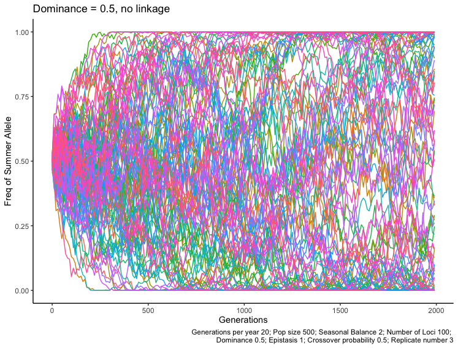
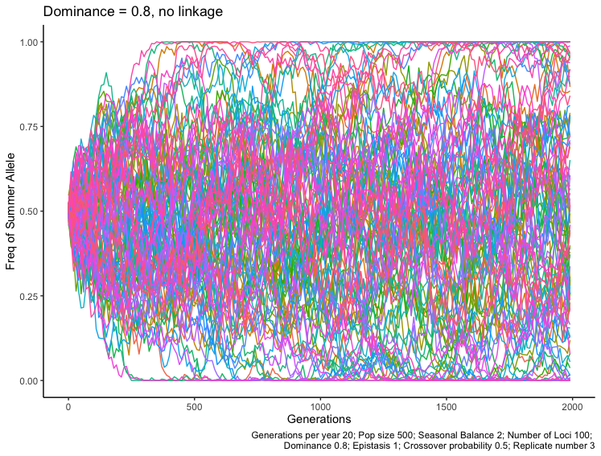

```{r global_options, include=FALSE}
knitr::opts_chunk$set(fig.pos = 'H')

require(tidyverse)
require(cowplot)
require(rlist)
require(png) 
require(knitr)
source(here::here("functions.R"))
```


# Abstract


# Introduction
Something about an orchard in Pennsylvania [@Bergland2014]. As an example of how to cite.

# Methods

## Basic Model

The method for calculating fitness is based on the work of @Wittmann2017 who originally proposed _segregation lift_ as a general mechanism which may maintain balanced polymorphisms in a population under certain conditions. 

The model first determines an individual's seasonal score ($z$) according to the equation:

$$
z = n_{homo} + d * n_{het}
$$
where $n_{homo}$ is the number loci homozygous for the allele particular to that certain season and $d$ is a dominance parameter (which ranges between 0 and 1) and $n_{het}$ is the number of heterozygous loci. A dominance parameter of greater than one ($d > 1$) would correspond to a traditional heterozygote advantage, and therefore is not of interest in this model.

The model we propose differs from the _segregation lift_ model in a few important ways. For one, the loci in our model are located on diploid linked chromosomes, so the homologous pairs can recombine during a simulated meiosis before mating. Expand on why this may be interesting or important… Linked genes not require a $d > 0.5$. Some genes that may be important for seasonal traits (_i.e._ heat shock proteins) are located close to each other on chromosomes and have a high amount of linkage disequilibrium… 

Our model also does not allow for “selfing” where an individual can asexually reproduce with itself to create an offspring… Other stufff maybe too


| Default Parameters               |           |
|----------------------------------|-----------|
| Crossover probability            | 0.05      |
| Mutation probability             | $10^{-4}$ |
| Population size                  | 500       |
| Number of loci                   | 100       |
| Exponent of the fitness function | 1         |
| Dominance                        | 0.5       |
| Years                            | 100       |
| Generations per year             | 20        |
| Seasonal balance                 | 2         |

## Simulated seasonal selection 

The general outline for the seasonal selection simulation:

1. A population of $N$ individuals is created with a single diploid chromosome containing $L$ loci, all of which contribute to the individual’s seasonal fitness. 
2. Seasonal score is calculated according to Eqn 1 and the fitness is determined
Pairs of parents – of size $N$ – are sampled stochasticly with a probability proportional to their seasonal fitness. 
3. Each parent in the pair undergoes recombination with a per locus recombination rate of $P_c$ 
4. A chromosome from each parent is selected at random to create the diploid offsprings 
5. The new generation replaces the old generation in the population.
6. The new individuals undergo mutation with a per locus mutation probability $P_m$ which was fixed at the relatively high rate of 1x10^-14 [@Haag-Liautard2007]. 
7. A new generation begins and the current season is determined by the current generation and seasonal balance parameter $S_b$. 
8. A new generation of parents is selected according to their seasonal fitness and the process continues to cycle for a number of years.
9. Loci specific allele frequencies are tracked throughout the simulated evolutionary run.


# Results

We first tested whether we were succsessful in reimplementing the model made by @Wittmann2017. We too found that with no linkage (i.e. cross-over happens at every loci) both the proportion of fixed loci (p = 2.52e-07) and standard deviation of loci frequencies (p = 4.63e-07) are lower when dominance is 0.8 compared to when dominance is 0.5. 

```{r, fig.height = 3, fig.width = 5, fig.cap = 'A density plot of the allele frequencies at the final generation for five replicates of each value of the epistatis parameter. \\label{epi_density}', message = FALSE, echo = FALSE}
setwd(here::here("results/cross_over"))

# load all files and filter only the final generation
all_tbl <- list.files(pattern = "c_0.5") %>% 
  map_df(~read_plus(.)) 

tbl_max_gen <- all_tbl %>%
  split(.$filename) %>%
  map(function(.data){filter(.data, genz == max(genz))}) %>%
  do.call("rbind", .)

# plot the density distribution
p1 <- ggplot(tbl_max_gen, aes(x = freqs, fill = filename)) +
        geom_density(alpha = 0.2) + 
        scale_fill_manual(values = c(rep("#e25dbb", 5), 
                                     rep("#6cdf4c", 5)),
                          breaks = unique(all_tbl$filename)[c(1,6)],
                          # legend name
                          name = "Dominance",
                          # values tested
                          labels = c("0.5", "0.8")) +
        ylab("Density") + 
        xlab("Allele Frequency") +
        theme_classic()

print(p1)

```

```{r, fig.width = 10}
# Small fig.width


```

Then, we started playing with different parameters.
## Crossover rate

Crossover rate didn't seem to have an effect at all in terms of standard deviation (p = 0.123) and proportion of fixed loci (p = 0.462). Our hypothesis is that crossover didn't have an effect because two opposing forces created by it canceled out. First of all, higher crossover rates creates more genetic variation in the population "helping" selection but on the other hand it also creates stochasticity since a selected high fitness individual can pass on an unfit chromosome after crossover by chance. 

When there was no crossover and so linkage was maximized there was a much bigger variation in the proportion of fixed loci in the last generation. This could be because since in this case the only way for an individual to change was through mutations, which is pretty infrequent, if the starting population contained a lot of individuals with more of one allele than the other many loci went to fixation while in a starting population with individuals whose genomes contained 50%-50% of the two alleles balancing polymorphism could be maintained more successfully. 

```{r, message = FALSE, include=FALSE}
setwd(here::here("results/cross_over"))
values = c("c_0_", "c_0.001", "c_0.01_", "c_0.05","c_0.1", "d_0.5_y_1_c_0.5_")
b <- do_analysis(values, "Dominance", "c_", "b3")
```
```{r, echo = FALSE}
b
```

## Dominance

Since the crossover rate didn't have an effect on whether or not balanced polymorphism is achieved, our tests with different dominance values resulted in the same dynamics as when we tested with crossover rate 0.5.

This is how you reference Figure \ref{dom_density} in the text.

```{r, fig.height = 3, fig.width = 5, fig.cap = 'A density plot of the allele frequencies at the final generation for five replicates of each value of dominance. \\label{dom_density}', message = FALSE, echo = FALSE}
setwd(here::here("results/dominance"))

# load all files and filter only the final generation
all_tbl <- list.files() %>% 
  map_df(~read_plus(.)) 

tbl_max_gen <- all_tbl %>%
  split(.$filename) %>%
  map(function(.data){filter(.data, genz == max(genz))}) %>%
  do.call("rbind", .)

# plot the density distribution
p2 <- ggplot(tbl_max_gen, aes(x = freqs, fill = filename)) +
        geom_density(alpha = 0.2) + 
        scale_fill_manual(values = c(rep("#e25dbb", 5), 
                                     rep("#6cdf4c", 5),
                                     rep("#258bd2", 5)),
                          breaks = unique(all_tbl$filename)[c(1,6,11)],
                          # legend name
                          name = "Dominance",
                          # values tested
                          labels = c("0.2", "0.5", "0.8")) +
        ylab("Density") + 
        xlab("Allele Frequency") +
        theme_classic()

print(p2)

```


## Epistasis

Under default crossover rate (0.05) epistasis didn't have an effect (standard deviation p = 0.986, proportion of fixed alleles p = 0.613).

This is how you reference Figure \ref{epi_density} in the text.

```{r, fig.height = 3, fig.width = 5, fig.cap = 'A density plot of the allele frequencies at the final generation for five replicates of each value of the epistatis parameter. \\label{epi_density}', message = FALSE, echo = FALSE}
setwd(here::here("results/epistasis"))

# load all files and filter only the final generation
all_tbl <- list.files(pattern = "c_0.05") %>% 
  map_df(~read_plus(.)) 

tbl_max_gen <- all_tbl %>%
  split(.$filename) %>%
  map(function(.data){filter(.data, genz == max(genz))}) %>%
  do.call("rbind", .)

# plot the density distribution
p1 <- ggplot(tbl_max_gen, aes(x = freqs, fill = filename)) +
        geom_density(alpha = 0.2) + 
        scale_fill_manual(values = c(rep("#e25dbb", 5), 
                                     rep("#6cdf4c", 5),
                                     rep("#258bd2", 5)),
                          breaks = unique(all_tbl$filename)[c(1,6,11)],
                          # legend name
                          name = "Epistasis",
                          # values tested
                          labels = c("0.5", "1", "2")) +
        ylab("Density") + 
        xlab("Allele Frequency") +
        theme_classic()

print(p1)

```

## Generations per season

When the generations per season was 10, the standard deviation was significantly lower than for longer generation times per season (p = 0.00161). We hypothise that with more generations per season loci were under selection for a longer period of time and thus were more likely to go to fixation at one point.

This is how you reference Figure \ref{gen_density} in the text.

```{r, fig.height = 3, fig.width = 5, fig.cap = 'A density plot of the allele frequencies at the final generation for five replicates of each number of generations per year. \\label{gen_density}', message = FALSE, echo = FALSE}
setwd(here::here("results/generations"))

# load all files and filter only the final generation
all_tbl <- list.files() %>% 
  map_df(~read_plus(.)) 

tbl_max_gen <- all_tbl %>%
  split(.$filename) %>%
  map(function(.data){filter(.data, genz == max(genz))}) %>%
  do.call("rbind", .)

# plot the density distribution
p3 <- ggplot(tbl_max_gen, aes(x = freqs, fill = filename)) +
        geom_density(alpha = 0.2) + 
        scale_fill_manual(values = c(rep("#e25dbb", 5), 
                                     rep("#6cdf4c", 5),
                                     rep("#258bd2", 5)),
                          breaks = unique(all_tbl$filename)[c(1,6,11)],
                          # legend name
                          name = "Generations\nper year",
                          # values tested
                          labels = c("10", "20", "50")) +
        ylab("Density") + 
        xlab("Allele Frequency") +
        theme_classic()

print(p3)
```

```{r, fig.width = 10}
# Small fig.width
knitr::include_graphics("G10.png")
knitr::include_graphics("G50.png")
```

## Population size

Population size had the biggest effect by far (standard deviation p = 1.51e-10, proportion of fixed loci p = 1.63e-10). Purely by changing population size from 100 to 1000 average proportion of fixed loci decreased from 0.9 to 0.3. This is probably due to the effect of random genetic drift; when the population is small alleles go to fixation due to the large effect of drift.

```{r}
setwd(here::here("results/pop_size"))
values = c("Ps_100_", "Ps_500", "Ps_1000")
b <- do_analysis(values, "Generations per semester", "Ps_", "b3")
```
```{r, echo = FALSE}
b
```

## Seasonal balance

Interestingly, having a season that has more generations than in the other didn't result in a higher proportion of fixed alleles as one whould have expected (p = 0.289). Rather, while alleles fixed by reaching frequencies of 0 or 1 in the case where both seasons had equal number of generations (seasonal balance = 2) when there were more generations in one more alleles had frequencies of 1 than 0 but the overall proportion stayed the same.


```{r, fig.height = 3, fig.width = 5, fig.cap = 'A density plot of the allele frequencies at the final generation for five replicates of each number of generations per year. \\label{gen_density}', message = FALSE, echo = FALSE}
setwd(here::here("results/seasonal_balance"))

# load all files and filter only the final generation
all_tbl <- list.files() %>% 
  map_df(~read_plus(.)) 

tbl_max_gen <- all_tbl %>%
  split(.$filename) %>%
  map(function(.data){filter(.data, genz == max(genz))}) %>%
  do.call("rbind", .)

# plot the density distribution
p3 <- ggplot(tbl_max_gen, aes(x = freqs, fill = filename)) +
        geom_density(alpha = 0.2) + 
        scale_fill_manual(values = c(rep("#e25dbb", 5), 
                                     rep("#6cdf4c", 5),
                                     rep("#258bd2", 5)),
                          breaks = unique(all_tbl$filename)[c(1,6,11)],
                          # legend name
                          name = "Generations\nper year",
                          # values tested
                          labels = c("1.25", "1.5", "2")) +
        ylab("Density") + 
        xlab("Allele Frequency") +
        theme_classic()

print(p3)

```


## Mutational interaction

Since crossover rate didn't have an effect we decided to test the scenario when loci have a certain interaction between them. In real genomes mutations often have different fitness effects depending on the genetic background i.e. the presence of other mutations. Thus, linkage can be advantageous if specific combinations of mutations are better kept together because of their reinforcing effect on each other. In this simulation we kept the same fitness function as before but also rewarded sequences of the benefitial allele. For example, in the summer an individual with chromosome 010101 would have a fitness of 3 while an individual with chromosome 011000 would have a fitness of 2 + 2 (for the longest sequence in the genome) which would then outcompete the former individual eventhough the total number of 1's is less. 

```{r}
setwd(here::here("results/mut_interaction"))
values = c("c_0.5_new", "c_0.05_new", "c_0.5_num", "c_0.05_num")
b <- do_analysis(values, "Generations per semester", "none", "b3")
```

```{r, fig.height = 3, fig.width = 8 , fig.cap = 'A density plot of the allele frequencies at the final generation \\label{density_combined}', message = FALSE, echo = FALSE}

# this is how you could potentially mash a few figures together in the same plot
plot_grid(p1, p2, labels = "AUTO")
```

# Discussion


# References

